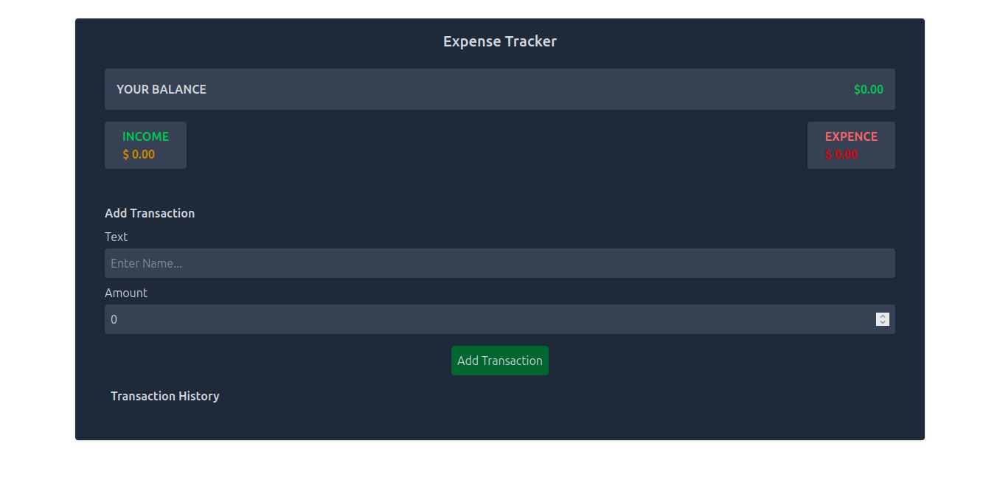

# Expense Tracker

An intuitive and responsive Expense Tracker application built with **React** and **Vite**. This app allows users to manage their finances by tracking income and expenses in real-time.

## Features

- **Add Transactions**: Easily add income or expense transactions with a description and amount.
- **Transaction History**: View a list of all transactions with the ability to delete any transaction.
- **Balance Overview**: Displays the current balance, total income, and total expenses.
- **Responsive Design**: Optimized for both desktop and mobile devices.
- **State Management**: Uses React Context API and Reducer for managing global state.

## Technologies Used

- **React**: For building the user interface.
- **Vite**: For fast development and build tooling.
- **Tailwind CSS**: For styling the application.
- **React Context API**: For state management.

## Screenshot

<a href='https://expense-tracker-app-mu-one.vercel.app/'>Preview </a>

---

# Expense-Tracker-App
